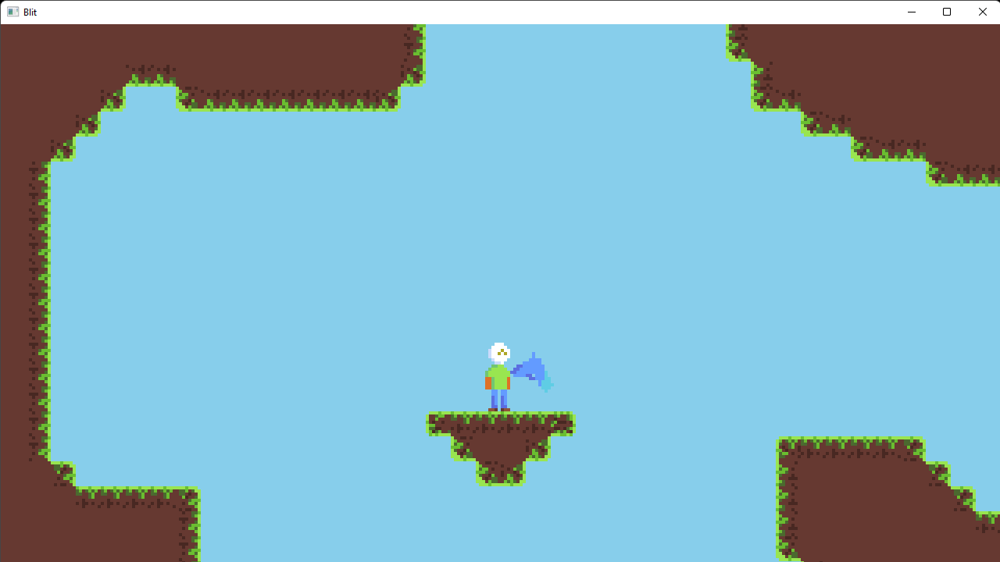

# MoonEngine - An engine used to make (semi-)powerful games.
MoonEngine (or Moon) is a 70KB game engine that I've (oti) been working on, that's quite modular with help of backends (i.e. SDL2).

**NOTE**: Because this engine is under rapid development, this is Alpha.

Some features of the engine include:

- `Camera` - A camera system
- `Font` - A font rendering system
- `Input` - An input handler
- `Map` - A Tiled renderer and parser
- `Sound` - A sound system

...and more!

## Questions (and stuff)

### Why did you make Moon?
In the summer of 2022, I wanted to fully dedicate my self to make a game after failing multiple times. I picked up SDL and started developing, and here I am! 

### This has no editor, so it's not a game engine!
While you could state having an editor to be the only indication of a game engine, the codebase of Moon is at a such high level, it's more or less an engine (or at least a framework).

### Where can I find `$(FEATURE)`?
If you can't find what you are looking for, you can make it! Add it to the repo if you wish!

### NO DOCS!!!
Sorry, the current documentation (if you can call it that), is really simple. I might add Doxygen to it, though!

## Example
Plugging these 10 lines of code into a working environment will give a blank window:
```
#include "MoonEngine.h"
int main() {
	Window window;
	InitWin(&window, 1024, 720, "Moon");
	while (WindowIsOpen(&window, 60)) {
		printf("Window open, running at 60 fps!");
	}
	End(window);
	return 0;
}
```

This is the same code in "main.c".

## Compilation
To compile Moon, you need:

- SDL2_ttf
- SDL2_image
- SDL2
- SDL2_mixer
- SDL2main (on Windows)

### If you're running Windows
Aside from needing SDL2main, you'd need to put the include library fake statics in `lib/` and headers in `lib/include`. The `.dll`s go to the same directory as the exectuable (like normal).

## Photos
